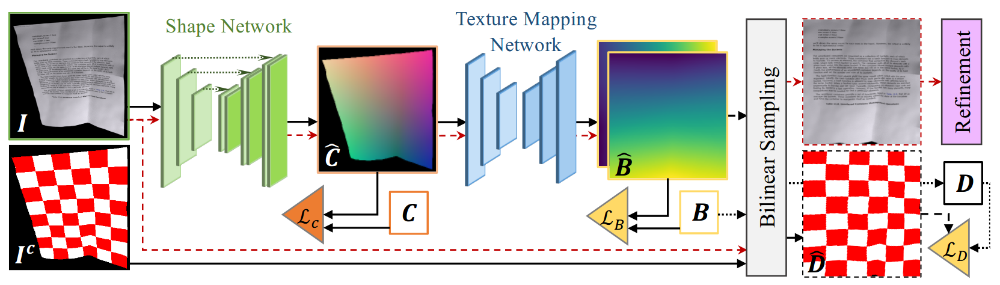

<p align="center">
  
</p>

# DewarpNet 
This repository contains the codes for [**DewarpNet**](https://www3.cs.stonybrook.edu/~cvl/projects/dewarpnet/storage/paper.pdf) training.

### Recent Updates
- **[May, 2020]** Added evaluation images and an important note about Matlab SSIM.

### Training
- Prepare Data: `train.txt` & `val.txt`. Contents should be like: 
```
1/824_8-cp_Page_0503-7Ns0001
1/824_1-cp_Page_0504-2Cw0001
```
- Train Shape Network:
`python trainwc.py --arch unetnc --data_path ./data/DewarpNet/doc3d/ --batch_size 50 --tboard`
- Train Texture Mapping Network:
`python trainbm.py --arch dnetccnl --img_rows 128 --img_cols 128 --img_norm --n_epoch 250 --batch_size 50 --l_rate 0.0001 --tboard --data_path ./DewarpNet/doc3d`

### Inference:
- Run:
`python infer.py --wc_model_path ./eval/models/unetnc_doc3d.pkl --bm_model_path ./eval/models/dnetccnl_doc3d.pkl --show`

### Evaluation:
- We use the same evaluation code as [DocUNet](https://www3.cs.stonybrook.edu/~cvl/docunet.html). 
To reproduce the quantitative results reported in the paper use the images available [here](https://drive.google.com/drive/folders/1aPfQHGrGxpuIbYLONydbSkGNygRX2z2P?usp=sharing).

- **[Important note about Matlab version]** We noticed that Matlab 2020a uses a different SSIM implementation which gives a better MS-SSIM score (0.5623). Whereas we have used Matlab 2018b. Please compare the scores according to your Matlab version. 

### Models:
- Pre-trained models are available [here](https://drive.google.com/file/d/1hJKCb4eF1AJih_dhZOJSF5VR-ZtRNaap/view?usp=sharing).

### Dataset: 
- The *doc3D dataset* can be downloaded using the scripts [here](https://github.com/cvlab-stonybrook/doc3D-dataset).

### More Stuff:
- [Demo](https://sagniklp.github.io/dewarpnet-demo/)
- [Project Page](https://www3.cs.stonybrook.edu/~cvl/projects/dewarpnet/)
- [Doc3D Rendering Codes](https://github.com/sagniklp/doc3D-renderer)
### Citation:
If you use the dataset or this code, please consider citing our work-
```
@inproceedings{SagnikKeICCV2019, 
Author = {Sagnik Das*, Ke Ma*, Zhixin Shu, Dimitris Samaras, Roy Shilkrot}, 
Booktitle = {Proceedings of International Conference on Computer Vision}, 
Title = {DewarpNet: Single-Image Document Unwarping With Stacked 3D and 2D Regression Networks}, 
Year = {2019}}   
```
#### Acknowledgements:
- These codes are heavily structured on [pytorch-semseg](https://github.com/meetshah1995/pytorch-semseg).
